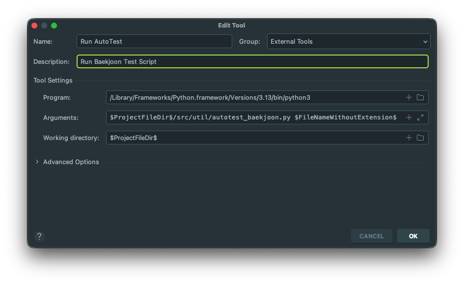

# Coding-Test

---
이 레포는 [백준](https://www.acmicpc.net/) / [LeetCode](https://leetcode.com/)의 문제 풀이 소스와 관련 유틸 프로그램들의 백업 목적으로 생성되었습니다!

| Baekjoon                                                                                               | LeetCode                                                                                   |
|--------------------------------------------------------------------------------------------------------|--------------------------------------------------------------------------------------------|
| [](https://solved.ac/cubeweek) |  |
<!--img src="https://leetcode-badge-showcase.vercel.app/api?username=cube_week-99&animated=true" alt="LeetCode Badges" /-->


# 푼 문제 / 소스 Link

---
레포 내에 존재하는 백준 / 리트코드 문제와 소스 링크를 [문제].[소스] 형태로 보실 수 있습니다.

### Baekjoon - Solved Index
<!-- BACKJOON-AUTO-GENERATED:START -->
<details>
<summary>BRONZE</summary>

**B1**  
<sub>[1259](https://www.acmicpc.net/problem/1259.<small>[src](src/problem/backjoon/bronze/b1/BJ1259.kt)</small>)</sub> <sub>[1546](https://www.acmicpc.net/problem/1546.<small>[src](src/problem/backjoon/bronze/b1/BJ1546.java)</small>)</sub> <sub>[2163](https://www.acmicpc.net/problem/2163.<small>[src](src/problem/backjoon/bronze/b1/BJ2163.kt)</small>)</sub> <sub>[2609](https://www.acmicpc.net/problem/2609.<small>[src](src/problem/backjoon/bronze/b1/BJ2609.kt)</small>)</sub> <sub>[2775](https://www.acmicpc.net/problem/2775.<small>[src](src/problem/backjoon/bronze/b1/BJ2775.kt)</small>)</sub> <sub>[2869](https://www.acmicpc.net/problem/2869.<small>[src](src/problem/backjoon/bronze/b1/BJ2869.kt)</small>)</sub> <sub>[2999](https://www.acmicpc.net/problem/2999.<small>[src](src/problem/backjoon/bronze/b1/BJ2999.kt)</small>)</sub> <sub>[3985](https://www.acmicpc.net/problem/3985.<small>[src](src/problem/backjoon/bronze/b1/BJ3985.kt)</small>)</sub> <sub>[8595](https://www.acmicpc.net/problem/8595.<small>[src](src/problem/backjoon/bronze/b1/BJ8595.kt)</small>)</sub> <sub>[10989](https://www.acmicpc.net/problem/10989.<small>[src](src/problem/backjoon/bronze/b1/BJ10989.kt)</small>)</sub> <sub>[11050](https://www.acmicpc.net/problem/11050.<small>[src](src/problem/backjoon/bronze/b1/BJ11050.kt)</small>)</sub> <sub>[14626](https://www.acmicpc.net/problem/14626.<small>[src](src/problem/backjoon/bronze/b1/BJ14626.kt)</small>)</sub> <sub>[16020](https://www.acmicpc.net/problem/16020.<small>[src](src/problem/backjoon/bronze/b1/BJ16020.kt)</small>)</sub> <sub>[16189](https://www.acmicpc.net/problem/16189.<small>[src](src/problem/backjoon/bronze/b1/BJ16189.kt)</small>)</sub> <sub>[24052](https://www.acmicpc.net/problem/24052.<small>[src](src/problem/backjoon/bronze/b1/BJ24052.kt)</small>)</sub> <sub>[28702](https://www.acmicpc.net/problem/28702.<small>[src](src/problem/backjoon/bronze/b1/BJ28702.kt)</small>)</sub>

**B2**  
<sub>[1152](https://www.acmicpc.net/problem/1152.<small>[src](src/problem/backjoon/bronze/b2/BJ1152.java)</small>)</sub> <sub>[1978](https://www.acmicpc.net/problem/1978.<small>[src](src/problem/backjoon/bronze/b2/BJ1978.kt)</small>)</sub> <sub>[2231](https://www.acmicpc.net/problem/2231.<small>[src](src/problem/backjoon/bronze/b2/BJ2231.kt)</small>)</sub> <sub>[2292](https://www.acmicpc.net/problem/2292.<small>[src](src/problem/backjoon/bronze/b2/BJ2292.kt)</small>)</sub> <sub>[2577](https://www.acmicpc.net/problem/2577.<small>[src](src/problem/backjoon/bronze/b2/BJ2577.java)</small>)</sub> <sub>[2675](https://www.acmicpc.net/problem/2675.<small>[src](src/problem/backjoon/bronze/b2/BJ2675.java)</small>)</sub> <sub>[2750](https://www.acmicpc.net/problem/2750.<small>[src](src/problem/backjoon/bronze/b2/BJ2750.java)</small>)</sub> <sub>[2798](https://www.acmicpc.net/problem/2798.<small>[src](src/problem/backjoon/bronze/b2/BJ2798.kt)</small>)</sub> <sub>[2920](https://www.acmicpc.net/problem/2920.<small>[src](src/problem/backjoon/bronze/b2/BJ2920.java)</small>)</sub> <sub>[2979](https://www.acmicpc.net/problem/2979.<small>[src](src/problem/backjoon/bronze/b2/BJ2979.kt)</small>)</sub> <sub>[3052](https://www.acmicpc.net/problem/3052.<small>[src](src/problem/backjoon/bronze/b2/BJ3052.java)</small>)</sub> <sub>[3778](https://www.acmicpc.net/problem/3778.<small>[src](src/problem/backjoon/bronze/b2/BJ3778.kt)</small>)</sub> <sub>[5698](https://www.acmicpc.net/problem/5698.<small>[src](src/problem/backjoon/bronze/b2/BJ5698.kt)</small>)</sub> <sub>[6040](https://www.acmicpc.net/problem/6040.<small>[src](src/problem/backjoon/bronze/b2/BJ6040.kt)</small>)</sub> <sub>[6679](https://www.acmicpc.net/problem/6679.<small>[src](src/problem/backjoon/bronze/b2/BJ6679.java)</small>)</sub> <sub>[7600](https://www.acmicpc.net/problem/7600.<small>[src](src/problem/backjoon/bronze/b2/BJ7600.java)</small>)</sub> <sub>[8949](https://www.acmicpc.net/problem/8949.<small>[src](src/problem/backjoon/bronze/b2/BJ8949.kt)</small>)</sub> <sub>[8958](https://www.acmicpc.net/problem/8958.<small>[src](src/problem/backjoon/bronze/b2/BJ8958.java)</small>)</sub> <sub>[10809](https://www.acmicpc.net/problem/10809.<small>[src](src/problem/backjoon/bronze/b2/BJ10809.java)</small>)</sub> <sub>[10870](https://www.acmicpc.net/problem/10870.<small>[src](src/problem/backjoon/bronze/b2/BJ10870.kt)</small>)</sub> <sub>[15829](https://www.acmicpc.net/problem/15829.<small>[src](src/problem/backjoon/bronze/b2/BJ15829.kt)</small>)</sub> <sub>[16770](https://www.acmicpc.net/problem/16770.<small>[src](src/problem/backjoon/bronze/b2/BJ16770.kt)</small>)</sub>

**B3**  
<sub>[2562](https://www.acmicpc.net/problem/2562.<small>[src](src/problem/backjoon/bronze/b3/BJ2562.java)</small>)</sub> <sub>[2738](https://www.acmicpc.net/problem/2738.<small>[src](src/problem/backjoon/bronze/b3/BJ2738.kt)</small>)</sub> <sub>[2884](https://www.acmicpc.net/problem/2884.<small>[src](src/problem/backjoon/bronze/b3/BJ2884.java)</small>)</sub> <sub>[2975](https://www.acmicpc.net/problem/2975.<small>[src](src/problem/backjoon/bronze/b3/BJ2975.kt)</small>)</sub> <sub>[4153](https://www.acmicpc.net/problem/4153.<small>[src](src/problem/backjoon/bronze/b3/BJ4153.java)</small>)</sub> <sub>[5597](https://www.acmicpc.net/problem/5597.<small>[src](src/problem/backjoon/bronze/b3/BJ5597.kt)</small>)</sub> <sub>[6830](https://www.acmicpc.net/problem/6830.<small>[src](src/problem/backjoon/bronze/b3/BJ6830.kt)</small>)</sub> <sub>[10250](https://www.acmicpc.net/problem/10250.<small>[src](src/problem/backjoon/bronze/b3/BJ10250.java)</small>)</sub> <sub>[10818](https://www.acmicpc.net/problem/10818.<small>[src](src/problem/backjoon/bronze/b3/BJ10818.java)</small>)</sub> <sub>[10824](https://www.acmicpc.net/problem/10824.<small>[src](src/problem/backjoon/bronze/b3/BJ10824.kt)</small>)</sub> <sub>[10872](https://www.acmicpc.net/problem/10872.<small>[src](src/problem/backjoon/bronze/b3/BJ10872.java)</small>)</sub> <sub>[11795](https://www.acmicpc.net/problem/11795.<small>[src](src/problem/backjoon/bronze/b3/BJ11795.kt)</small>)</sub> <sub>[13163](https://www.acmicpc.net/problem/13163.<small>[src](src/problem/backjoon/bronze/b3/BJ13163.kt)</small>)</sub> <sub>[14914](https://www.acmicpc.net/problem/14914.<small>[src](src/problem/backjoon/bronze/b3/BJ14914.kt)</small>)</sub> <sub>[15953](https://www.acmicpc.net/problem/15953.<small>[src](src/problem/backjoon/bronze/b3/BJ15953.kt)</small>)</sub> <sub>[23794](https://www.acmicpc.net/problem/23794.<small>[src](src/problem/backjoon/bronze/b3/BJ23794.java)</small>)</sub> <sub>[25024](https://www.acmicpc.net/problem/25024.<small>[src](src/problem/backjoon/bronze/b3/BJ25024.kt)</small>)</sub> <sub>[25285](https://www.acmicpc.net/problem/25285.<small>[src](src/problem/backjoon/bronze/b3/BJ25285.kt)</small>)</sub> <sub>[26594](https://www.acmicpc.net/problem/26594.<small>[src](src/problem/backjoon/bronze/b3/BJ26594.kt)</small>)</sub> <sub>[30802](https://www.acmicpc.net/problem/30802.<small>[src](src/problem/backjoon/bronze/b3/BJ30802.kt)</small>)</sub>

**B4**  
<sub>[2439](https://www.acmicpc.net/problem/2439.<small>[src](src/problem/backjoon/bronze/b4/BJ2439.java)</small>)</sub> <sub>[4714](https://www.acmicpc.net/problem/4714.<small>[src](src/problem/backjoon/bronze/b4/BJ4714.kt)</small>)</sub> <sub>[5532](https://www.acmicpc.net/problem/5532.<small>[src](src/problem/backjoon/bronze/b4/BJ5532.java)</small>)</sub> <sub>[11720](https://www.acmicpc.net/problem/11720.<small>[src](src/problem/backjoon/bronze/b4/BJ11720.java)</small>)</sub> <sub>[14038](https://www.acmicpc.net/problem/14038.<small>[src](src/problem/backjoon/bronze/b4/BJ14038.kt)</small>)</sub> <sub>[15552](https://www.acmicpc.net/problem/15552.<small>[src](src/problem/backjoon/bronze/b4/BJ15552.java)</small>)</sub> <sub>[17903](https://www.acmicpc.net/problem/17903.<small>[src](src/problem/backjoon/bronze/b4/BJ17903.kt)</small>)</sub> <sub>[21964](https://www.acmicpc.net/problem/21964.<small>[src](src/problem/backjoon/bronze/b4/BJ21964.java)</small>)</sub> <sub>[25640](https://www.acmicpc.net/problem/25640.<small>[src](src/problem/backjoon/bronze/b4/BJ25640.java)</small>)</sub> <sub>[27110](https://www.acmicpc.net/problem/27110.<small>[src](src/problem/backjoon/bronze/b4/BJ27110.java)</small>)</sub> <sub>[33964](https://www.acmicpc.net/problem/33964.<small>[src](src/problem/backjoon/bronze/b4/BJ33964.kt)</small>)</sub>

**B5**  
<sub>[1000](https://www.acmicpc.net/problem/1000.<small>[src](src/problem/backjoon/bronze/b5/BJ1000.java)</small>)</sub> <sub>[1001](https://www.acmicpc.net/problem/1001.<small>[src](src/problem/backjoon/bronze/b5/BJ1001.java)</small>)</sub> <sub>[1008](https://www.acmicpc.net/problem/1008.<small>[src](src/problem/backjoon/bronze/b5/BJ1008.java)</small>)</sub> <sub>[1330](https://www.acmicpc.net/problem/1330.<small>[src](src/problem/backjoon/bronze/b5/BJ1330.java)</small>)</sub> <sub>[2420](https://www.acmicpc.net/problem/2420.<small>[src](src/problem/backjoon/bronze/b5/BJ2420.java)</small>)</sub> <sub>[2438](https://www.acmicpc.net/problem/2438.<small>[src](src/problem/backjoon/bronze/b5/BJ2438.java)</small>)</sub> <sub>[2475](https://www.acmicpc.net/problem/2475.<small>[src](src/problem/backjoon/bronze/b5/BJ2475.java)</small>)</sub> <sub>[2558](https://www.acmicpc.net/problem/2558.<small>[src](src/problem/backjoon/bronze/b5/BJ2558.kt)</small>)</sub> <sub>[2739](https://www.acmicpc.net/problem/2739.<small>[src](src/problem/backjoon/bronze/b5/BJ2739.java)</small>)</sub> <sub>[2741](https://www.acmicpc.net/problem/2741.<small>[src](src/problem/backjoon/bronze/b5/BJ2741.java)</small>)</sub> <sub>[2743](https://www.acmicpc.net/problem/2743.<small>[src](src/problem/backjoon/bronze/b5/BJ2743.kt)</small>)</sub> <sub>[2744](https://www.acmicpc.net/problem/2744.<small>[src](src/problem/backjoon/bronze/b5/BJ2744.kt)</small>)</sub> <sub>[2753](https://www.acmicpc.net/problem/2753.<small>[src](src/problem/backjoon/bronze/b5/BJ2753.java)</small>)</sub> <sub>[5717](https://www.acmicpc.net/problem/5717.<small>[src](src/problem/backjoon/bronze/b5/BJ5717.java)</small>)</sub> <sub>[9498](https://www.acmicpc.net/problem/9498.<small>[src](src/problem/backjoon/bronze/b5/BJ9498.java)</small>)</sub> <sub>[10171](https://www.acmicpc.net/problem/10171.<small>[src](src/problem/backjoon/bronze/b5/BJ10171.java)</small>)</sub> <sub>[10172](https://www.acmicpc.net/problem/10172.<small>[src](src/problem/backjoon/bronze/b5/BJ10172.java)</small>)</sub> <sub>[10189](https://www.acmicpc.net/problem/10189.<small>[src](src/problem/backjoon/bronze/b5/BJ10189.kt)</small>)</sub> <sub>[10430](https://www.acmicpc.net/problem/10430.<small>[src](src/problem/backjoon/bronze/b5/BJ10430.kt)</small>)</sub> <sub>[10699](https://www.acmicpc.net/problem/10699.<small>[src](src/problem/backjoon/bronze/b5/BJ10699.java)</small>)</sub> <sub>[10807](https://www.acmicpc.net/problem/10807.<small>[src](src/problem/backjoon/bronze/b5/BJ10807.java)</small>)</sub> <sub>[10869](https://www.acmicpc.net/problem/10869.<small>[src](src/problem/backjoon/bronze/b5/BJ10869.java)</small>)</sub> <sub>[10871](https://www.acmicpc.net/problem/10871.<small>[src](src/problem/backjoon/bronze/b5/BJ10871.java)</small>)</sub> <sub>[10950](https://www.acmicpc.net/problem/10950.<small>[src](src/problem/backjoon/bronze/b5/BJ10950.java)</small>)</sub> <sub>[10951](https://www.acmicpc.net/problem/10951.<small>[src](src/problem/backjoon/bronze/b5/BJ10951.java)</small>)</sub> <sub>[10952](https://www.acmicpc.net/problem/10952.<small>[src](src/problem/backjoon/bronze/b5/BJ10952.java)</small>)</sub> <sub>[10998](https://www.acmicpc.net/problem/10998.<small>[src](src/problem/backjoon/bronze/b5/BJ10998.java)</small>)</sub> <sub>[11382](https://www.acmicpc.net/problem/11382.<small>[src](src/problem/backjoon/bronze/b5/BJ11382.java)</small>)</sub> <sub>[11654](https://www.acmicpc.net/problem/11654.<small>[src](src/problem/backjoon/bronze/b5/BJ11654.java)</small>)</sub> <sub>[13277](https://www.acmicpc.net/problem/13277.<small>[src](src/problem/backjoon/bronze/b5/BJ13277.java)</small>)</sub> <sub>[15680](https://www.acmicpc.net/problem/15680.<small>[src](src/problem/backjoon/bronze/b5/BJ15680.java)</small>)</sub> <sub>[15963](https://www.acmicpc.net/problem/15963.<small>[src](src/problem/backjoon/bronze/b5/BJ15963.java)</small>)</sub> <sub>[16430](https://www.acmicpc.net/problem/16430.<small>[src](src/problem/backjoon/bronze/b5/BJ16430.kt)</small>)</sub> <sub>[20492](https://www.acmicpc.net/problem/20492.<small>[src](src/problem/backjoon/bronze/b5/BJ20492.java)</small>)</sub> <sub>[21300](https://www.acmicpc.net/problem/21300.<small>[src](src/problem/backjoon/bronze/b5/BJ21300.java)</small>)</sub> <sub>[25083](https://www.acmicpc.net/problem/25083.<small>[src](src/problem/backjoon/bronze/b5/BJ25083.java)</small>)</sub> <sub>[25372](https://www.acmicpc.net/problem/25372.<small>[src](src/problem/backjoon/bronze/b5/BJ25372.java)</small>)</sub> <sub>[27389](https://www.acmicpc.net/problem/27389.<small>[src](src/problem/backjoon/bronze/b5/BJ27389.java)</small>)</sub> <sub>[27866](https://www.acmicpc.net/problem/27866.<small>[src](src/problem/backjoon/bronze/b5/BJ27866.java)</small>)</sub> <sub>[29751](https://www.acmicpc.net/problem/29751.<small>[src](src/problem/backjoon/bronze/b5/BJ29751.java)</small>)</sub> <sub>[30030](https://www.acmicpc.net/problem/30030.<small>[src](src/problem/backjoon/bronze/b5/BJ30030.java)</small>)</sub> <sub>[30087](https://www.acmicpc.net/problem/30087.<small>[src](src/problem/backjoon/bronze/b5/BJ30087.java)</small>)</sub> <sub>[30214](https://www.acmicpc.net/problem/30214.<small>[src](src/problem/backjoon/bronze/b5/BJ30214.kt)</small>)</sub> <sub>[30224](https://www.acmicpc.net/problem/30224.<small>[src](src/problem/backjoon/bronze/b5/BJ30224.java)</small>)</sub> <sub>[32326](https://www.acmicpc.net/problem/32326.<small>[src](src/problem/backjoon/bronze/b5/BJ32326.kt)</small>)</sub> <sub>[32929](https://www.acmicpc.net/problem/32929.<small>[src](src/problem/backjoon/bronze/b5/BJ32929.kt)</small>)</sub>

</details>

<details>
<summary>SILVER</summary>

**S1**  
<sub>[1747](https://www.acmicpc.net/problem/1747.<small>[src](src/problem/backjoon/silver/s1/BJ1747.kt)</small>)</sub> <sub>[2178](https://www.acmicpc.net/problem/2178.<small>[src](src/problem/backjoon/silver/s1/BJ2178.kt)</small>)</sub> <sub>[11286](https://www.acmicpc.net/problem/11286.<small>[src](src/problem/backjoon/silver/s1/BJ11286.kt)</small>)</sub> <sub>[11660](https://www.acmicpc.net/problem/11660.<small>[src](src/problem/backjoon/silver/s1/BJ11660.java)</small>)</sub> <sub>[14940](https://www.acmicpc.net/problem/14940.<small>[src](src/problem/backjoon/silver/s1/BJ14940.kt)</small>)</sub>

**S2**  
<sub>[1260](https://www.acmicpc.net/problem/1260.<small>[src](src/problem/backjoon/silver/s2/BJ1260.kt)</small>)</sub> <sub>[1406](https://www.acmicpc.net/problem/1406.<small>[src](src/problem/backjoon/silver/s2/BJ1406.kt)</small>)</sub> <sub>[1541](https://www.acmicpc.net/problem/1541.<small>[src](src/problem/backjoon/silver/s2/BJ1541.kt)</small>)</sub> <sub>[1654](https://www.acmicpc.net/problem/1654.<small>[src](src/problem/backjoon/silver/s2/BJ1654.kt)</small>)</sub> <sub>[1874](https://www.acmicpc.net/problem/1874.<small>[src](src/problem/backjoon/silver/s2/BJ1874.kt)</small>)</sub> <sub>[2108](https://www.acmicpc.net/problem/2108.<small>[src](src/problem/backjoon/silver/s2/BJ2108.kt)</small>)</sub> <sub>[2512](https://www.acmicpc.net/problem/2512.<small>[src](src/problem/backjoon/silver/s2/BJ2512.kt)</small>)</sub> <sub>[2805](https://www.acmicpc.net/problem/2805.<small>[src](src/problem/backjoon/silver/s2/BJ2805.kt)</small>)</sub> <sub>[11724](https://www.acmicpc.net/problem/11724.<small>[src](src/problem/backjoon/silver/s2/BJ11724.kt)</small>)</sub> <sub>[12891](https://www.acmicpc.net/problem/12891.<small>[src](src/problem/backjoon/silver/s2/BJ12891.java)</small>)</sub> <sub>[31462](https://www.acmicpc.net/problem/31462.<small>[src](src/problem/backjoon/silver/s2/BJ31462.kt)</small>)</sub>

**S3**  
<sub>[1929](https://www.acmicpc.net/problem/1929.<small>[src](src/problem/backjoon/silver/s3/BJ1929.kt)</small>)</sub> <sub>[1966](https://www.acmicpc.net/problem/1966.<small>[src](src/problem/backjoon/silver/s3/BJ1966.kt)</small>)</sub> <sub>[11659](https://www.acmicpc.net/problem/11659.<small>[src](src/problem/backjoon/silver/s3/BJ11659.java)</small>)</sub> <sub>[15649](https://www.acmicpc.net/problem/15649.<small>[src](src/problem/backjoon/silver/s3/BJ15649.kt)</small>)</sub> <sub>[26267](https://www.acmicpc.net/problem/26267.<small>[src](src/problem/backjoon/silver/s3/BJ26267.kt)</small>)</sub> <sub>[30701](https://www.acmicpc.net/problem/30701.<small>[src](src/problem/backjoon/silver/s3/BJ30701.kt)</small>)</sub> <sub>[30884](https://www.acmicpc.net/problem/30884.<small>[src](src/problem/backjoon/silver/s3/BJ30884.kt)</small>)</sub> <sub>[32201](https://www.acmicpc.net/problem/32201.<small>[src](src/problem/backjoon/silver/s3/BJ32201.kt)</small>)</sub>

**S4**  
<sub>[1049](https://www.acmicpc.net/problem/1049.<small>[src](src/problem/backjoon/silver/s4/BJ1049.kt)</small>)</sub> <sub>[1748](https://www.acmicpc.net/problem/1748.<small>[src](src/problem/backjoon/silver/s4/BJ1748.kt)</small>)</sub> <sub>[1920](https://www.acmicpc.net/problem/1920.<small>[src](src/problem/backjoon/silver/s4/BJ1920.kt)</small>)</sub> <sub>[1940](https://www.acmicpc.net/problem/1940.<small>[src](src/problem/backjoon/silver/s4/BJ1940.java)</small>)</sub> <sub>[2164](https://www.acmicpc.net/problem/2164.<small>[src](src/problem/backjoon/silver/s4/BJ2164.kt)</small>)</sub> <sub>[2839](https://www.acmicpc.net/problem/2839.<small>[src](src/problem/backjoon/silver/s4/BJ2839.kt)</small>)</sub> <sub>[4949](https://www.acmicpc.net/problem/4949.<small>[src](src/problem/backjoon/silver/s4/BJ4949.kt)</small>)</sub> <sub>[9012](https://www.acmicpc.net/problem/9012.<small>[src](src/problem/backjoon/silver/s4/BJ9012.kt)</small>)</sub> <sub>[10773](https://www.acmicpc.net/problem/10773.<small>[src](src/problem/backjoon/silver/s4/BJ10773.kt)</small>)</sub> <sub>[10816](https://www.acmicpc.net/problem/10816.<small>[src](src/problem/backjoon/silver/s4/BJ10816.kt)</small>)</sub> <sub>[10828](https://www.acmicpc.net/problem/10828.<small>[src](src/problem/backjoon/silver/s4/BJ10828.kt)</small>)</sub> <sub>[10845](https://www.acmicpc.net/problem/10845.<small>[src](src/problem/backjoon/silver/s4/BJ10845.kt)</small>)</sub> <sub>[11047](https://www.acmicpc.net/problem/11047.<small>[src](src/problem/backjoon/silver/s4/BJ11047.kt)</small>)</sub> <sub>[11399](https://www.acmicpc.net/problem/11399.<small>[src](src/problem/backjoon/silver/s4/BJ11399.kt)</small>)</sub> <sub>[11866](https://www.acmicpc.net/problem/11866.<small>[src](src/problem/backjoon/silver/s4/BJ11866.kt)</small>)</sub> <sub>[18110](https://www.acmicpc.net/problem/18110.<small>[src](src/problem/backjoon/silver/s4/BJ18110.kt)</small>)</sub>

**S5**  
<sub>[1181](https://www.acmicpc.net/problem/1181.<small>[src](src/problem/backjoon/silver/s5/BJ1181.kt)</small>)</sub> <sub>[1427](https://www.acmicpc.net/problem/1427.<small>[src](src/problem/backjoon/silver/s5/BJ1427.kt)</small>)</sub> <sub>[1436](https://www.acmicpc.net/problem/1436.<small>[src](src/problem/backjoon/silver/s5/BJ1436.kt)</small>)</sub> <sub>[1676](https://www.acmicpc.net/problem/1676.<small>[src](src/problem/backjoon/silver/s5/BJ1676.kt)</small>)</sub> <sub>[2018](https://www.acmicpc.net/problem/2018.<small>[src](src/problem/backjoon/silver/s5/BJ2018.java)</small>)</sub> <sub>[2161](https://www.acmicpc.net/problem/2161.<small>[src](src/problem/backjoon/silver/s5/BJ2161.kt)</small>)</sub> <sub>[2751](https://www.acmicpc.net/problem/2751.<small>[src](src/problem/backjoon/silver/s5/BJ2751.kt)</small>)</sub> <sub>[5043](https://www.acmicpc.net/problem/5043.<small>[src](src/problem/backjoon/silver/s5/BJ5043.kt)</small>)</sub> <sub>[7568](https://www.acmicpc.net/problem/7568.<small>[src](src/problem/backjoon/silver/s5/BJ7568.kt)</small>)</sub> <sub>[9656](https://www.acmicpc.net/problem/9656.<small>[src](src/problem/backjoon/silver/s5/BJ9656.kt)</small>)</sub> <sub>[10431](https://www.acmicpc.net/problem/10431.<small>[src](src/problem/backjoon/silver/s5/BJ10431.kt)</small>)</sub> <sub>[10814](https://www.acmicpc.net/problem/10814.<small>[src](src/problem/backjoon/silver/s5/BJ10814.kt)</small>)</sub> <sub>[10815](https://www.acmicpc.net/problem/10815.<small>[src](src/problem/backjoon/silver/s5/BJ10815.kt)</small>)</sub> <sub>[11004](https://www.acmicpc.net/problem/11004.<small>[src](src/problem/backjoon/silver/s5/BJ11004.kt)</small>)</sub> <sub>[11650](https://www.acmicpc.net/problem/11650.<small>[src](src/problem/backjoon/silver/s5/BJ11650.kt)</small>)</sub> <sub>[11651](https://www.acmicpc.net/problem/11651.<small>[src](src/problem/backjoon/silver/s5/BJ11651.kt)</small>)</sub> <sub>[13211](https://www.acmicpc.net/problem/13211.<small>[src](src/problem/backjoon/silver/s5/BJ13211.kt)</small>)</sub> <sub>[13241](https://www.acmicpc.net/problem/13241.<small>[src](src/problem/backjoon/silver/s5/BJ13241.kt)</small>)</sub> <sub>[17269](https://www.acmicpc.net/problem/17269.<small>[src](src/problem/backjoon/silver/s5/BJ17269.java)</small>)</sub> <sub>[25325](https://www.acmicpc.net/problem/25325.<small>[src](src/problem/backjoon/silver/s5/BJ25325.kt)</small>)</sub>

</details>

<details>
<summary>GOLD</summary>

**G1**  
<sub>[1016](https://www.acmicpc.net/problem/1016.<small>[src](src/problem/backjoon/gold/g1/BJ1016.kt)</small>)</sub> <sub>[1300](https://www.acmicpc.net/problem/1300.<small>[src](src/problem/backjoon/gold/g1/BJ1300.kt)</small>)</sub> <sub>[11003](https://www.acmicpc.net/problem/11003.<small>[src](src/problem/backjoon/gold/g1/BJ11003.kt)</small>)</sub> <sub>[11689](https://www.acmicpc.net/problem/11689.<small>[src](src/problem/backjoon/gold/g1/BJ11689.kt)</small>)</sub>

**G2**  
<sub>[1033](https://www.acmicpc.net/problem/1033.<small>[src](src/problem/backjoon/gold/g2/BJ1033.kt)</small>)</sub> <sub>[1167](https://www.acmicpc.net/problem/1167.<small>[src](src/problem/backjoon/gold/g2/BJ1167.kt)</small>)</sub> <sub>[1377](https://www.acmicpc.net/problem/1377.<small>[src](src/problem/backjoon/gold/g2/BJ1377.kt)</small>)</sub> <sub>[17136](https://www.acmicpc.net/problem/17136.<small>[src](src/problem/backjoon/gold/g2/BJ17136.kt)</small>)</sub>

**G3**  
<sub>[10986](https://www.acmicpc.net/problem/10986.<small>[src](src/problem/backjoon/gold/g3/BJ10986.java)</small>)</sub>

**G4**  
<sub>[1253](https://www.acmicpc.net/problem/1253.<small>[src](src/problem/backjoon/gold/g4/BJ1253.java)</small>)</sub> <sub>[1715](https://www.acmicpc.net/problem/1715.<small>[src](src/problem/backjoon/gold/g4/BJ1715.kt)</small>)</sub> <sub>[1744](https://www.acmicpc.net/problem/1744.<small>[src](src/problem/backjoon/gold/g4/BJ1744.kt)</small>)</sub> <sub>[9663](https://www.acmicpc.net/problem/9663.<small>[src](src/problem/backjoon/gold/g4/BJ9663.kt)</small>)</sub> <sub>[17298](https://www.acmicpc.net/problem/17298.<small>[src](src/problem/backjoon/gold/g4/BJ17298.kt)</small>)</sub>

**G5**  
<sub>[1456](https://www.acmicpc.net/problem/1456.<small>[src](src/problem/backjoon/gold/g5/BJ1456.kt)</small>)</sub> <sub>[1931](https://www.acmicpc.net/problem/1931.<small>[src](src/problem/backjoon/gold/g5/BJ1931.kt)</small>)</sub> <sub>[2023](https://www.acmicpc.net/problem/2023.<small>[src](src/problem/backjoon/gold/g5/BJ2023.kt)</small>)</sub> <sub>[2343](https://www.acmicpc.net/problem/2343.<small>[src](src/problem/backjoon/gold/g5/BJ2343.kt)</small>)</sub> <sub>[2493](https://www.acmicpc.net/problem/2493.<small>[src](src/problem/backjoon/gold/g5/BJ2493.kt)</small>)</sub> <sub>[13023](https://www.acmicpc.net/problem/13023.<small>[src](src/problem/backjoon/gold/g5/BJ13023.kt)</small>)</sub>

</details>

<details>
<summary>PLATINUM</summary>

**P5**  
<sub>[6549](https://www.acmicpc.net/problem/6549.<small>[src](src/problem/backjoon/platinum/p5/BJ6549.kt)</small>)</sub>

</details>

<!-- BACKJOON-AUTO-GENERATED:END -->

### LeetCode - Solved Index
<!-- LEETCODE-AUTO-GENERATED:START -->
<!-- LEETCODE-AUTO-GENERATED:END -->


## Utilities

---
관련 유틸들은 모두 Python 기반으로 만들어져 사용하시려면 Python 및 추가 라이브러리들의 설치가 필요합니다.

<details>
<summary><strong>Baekjoon 예제 자동 채점(Kotlin ONLY!)</strong></summary>
한땀 한땀 실행-예제를 입력하던 불편함을 딸-깍 한 번으로 해결하기 위해<br>
백준 문제 페이지의 예제 입력/출력을 자동으로 가져와(재시도부터는 캐시 사용) 로컬에서 Kotlin 풀이를 컴파일/실행하고 결과를 비교합니다.

- Script: `autotest_baekjoon.py`
  - What it does:
      - BOJ 문제 페이지에서 sample input/output을 수집합니다. (Selenium 사용)
      - 수집한 예제는 `.boj_cache/{problemId}.json`에 캐시합니다.
      - `src/problem/baekjoon/**/BJ{problemId}.kt` 파일을 찾아 `kotlinc`로 컴파일 후 실행합니다.
      - 각 케이스별로 출력이 일치하는지 확인하고, 불일치 시 Expected/Actual을 출력합니다.

#### Requirements
- Python 3
  - Google Chrome (headless)
  - `selenium`, `BeautifulSoup`등의 라이브러리가 없는 경우 설치 필요

#### Usage
- 인텔리제이 External Tools에 등록하여 사용

  <a href="./resources/setting_auto_test_baekjoon.png">
    
  </a>

- 터미널에서 사용할 경우(레포 최상위에서 실행)
  ```bash
  # 사용방법1 : BJ1300.kt를 찾아서 예제 케이스로 테스트
  python3 ./src/util/autotest_baekjoon.py BJ1300
  ```
  ```bash
  # 사용방법2 : 생성된 백준 예시 캐시 파일을 모두 삭제하고 싶은 경우
  python3 ./src/util/autotest_baekjoon.py clear
  ```
</details>